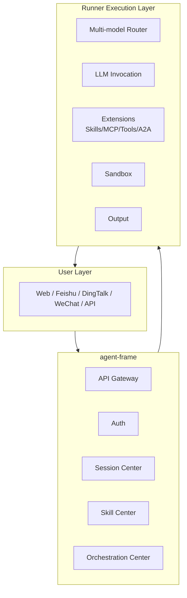

# XiaoQinglong 小青龙

English | [中文](./README.md)

**Enterprise-Grade AI Agent Runtime Framework** - Deploy AI Agents to production with confidence

[](./LICENSE)
[](https://golang.org)
[]()

> 小青龙 is an enterprise agent operating system featuring multi-channel integration, multi-model routing, visual orchestration, skill ecosystem, MCP protocol, and sandbox execution.

---

## Core Features

| Category | Features |
| -------- | -------- |
| **Model Capabilities** | Multi-model routing · Context compression · Prompt caching · Deep-agents |
| **Tool Ecosystem** | Skills · MCP (SSE/stdio/HTTP) · Tools · A2A · Auto skill creation |
| **Execution Guarantees** | Sandbox execution · Approval policies · Retry circuit breaker · Checkpoint |
| **Memory System** | user · feedback · project · reference |
| **Engineering** | Cron jobs · Sub-Agent parallelism · Knowledge retrieval |
| **Response Formats** | text · markdown · json · a2ui · multimedia |

---

## Why XiaoQinglong?

### Multi-Model Intelligent Routing

Automatically select the optimal model based on task role, balancing cost and quality:

| Role | Purpose | Typical Scenario |
| ---- | ------- | ---------------- |
| `default` | Main dialogue | User Q&A |
| `rewrite` | Query rewriting | Search enhancement |
| `skill` | Skill execution | Complex tasks |
| `summarize` | Content summarization | Long text summary |

### Enterprise-Grade Security

```
Risk-based approval + Whitelist auto-approve + Sandbox isolation
```

- **Approval Policies**: low/medium/high three-tier risk control
- **Sandbox Execution**: Docker / Local dual mode, dangerous operations isolated
- **Circuit Breaker**: Exponential backoff retry, prevent cascading failures

### Production-Grade Reliability

- **Checkpoint**: Resume from interruption, long-running tasks never lost
- **Context Compression**: Auto-compress context when token limit exceeded
- **Memory System**: Cross-session user preferences and context preservation

### Open Ecosystem

- **MCP Protocol**: Supports SSE / stdio / HTTP transport modes
- **A2A Protocol**: Agents call each other, build complex workflows
- **Skills Ecosystem**: Supports agent-skills, agents self-evolve to create skills to complete tasks

---

### Demo Scenarios
* Data Analysis:


* WeChat:


* Feishu:


* Rich features and orchestration:


## Architecture



---

## Quick Start

### 1. Start Runner

```bash
cd backend/runner
./runner
# Default listens on :18080
```

### 2. Send Request

```bash
curl -X POST http://localhost:18080/run \
  -H "Content-Type: application/json" \
  -d '{
    "prompt": "Analyze today weather",
    "models": {
      "default": {"name": "gpt-4o", "api_key": "sk-xxx", "api_base": "https://api.openai.com/v1"}
    },
    "options": {"stream": false}
  }'
```

### 3. Streaming Response

```bash
curl -X POST http://localhost:18080/run \
  -H "Content-Type: application/json" \
  -d '{"prompt": "Write some Python code", "options": {"stream": true}}'
# Supports SSE streaming output
```

---

## Runner Full Features

### Model Layer
- **Multi-model Routing**: default / rewrite / skill / summarize four roles
- **Context Compression**: Auto-compress when token limit exceeded (full/partial/micro strategies)
- **Prompt Caching**: Static section caching, avoid redundant computation
- **Deep-agents**: Deep reasoning mode, complex problem decomposition

### Tool Ecosystem
- **Skills**: Skill center, supports agent-skills, progressive loading + Auto skill creation
- **Skill Management**: skill_manage (create/modify/delete) + load_skill (on-demand loading)
- **MCP**: Supports SSE / stdio / HTTP transport modes
- **Tools**: Built-in bash / file / glob / grep / web-fetch and more
- **A2A**: Agent-to-Agent protocol, build distributed agent networks

### Execution Guarantees
- **Sandbox Execution**: Docker / Local dual mode, dangerous operations isolated
- **Approval Policies**: Risk-based levels + whitelist auto-approval
- **Retry Circuit Breaker**: Exponential backoff, configurable circuit breaker
- **Checkpoint**: Resume from interruption, long-running tasks never lost

### Memory System
- **user**: User information memory
- **feedback**: User feedback memory
- **project**: Project context memory
- **reference**: External knowledge references

### Engineering
- **Cron Jobs**: Cron expression, supports recurring execution
- **Sub-Agent**: hermes-agent style delegation (batch parallelism + depth limit + tool filtering + context isolation)
- **Knowledge Retrieval**: Multi-knowledge base config, RAG support

### Response Formats
- **text / markdown / json**: Text responses
- **a2ui**: Component format, frontend direct rendering
- **image / audio / video**: Multimedia generation
- **multipart**: Multi-format mixed responses

---

## Configuration Examples

### Multi-model Routing

```json
{
  "options": {
    "routing": {
      "default_model": "default",
      "rewrite_prompt": "Optimize the following user query...",
      "summarize_prompt": "Summarize the following content..."
    }
  }
}
```

### Retry & Circuit Breaker

```json
{
  "options": {
    "retry": {
      "max_attempts": 3,
      "initial_delay_ms": 1000,
      "max_delay_ms": 10000,
      "backoff_multiplier": 2.0,
      "circuit_breaker_threshold": 5,
      "circuit_breaker_duration_ms": 30000
    }
  }
}
```

### Sandbox Execution

```json
{
  "sandbox": {
    "enabled": true,
    "mode": "docker",
    "image": "python:3.11-slim",
    "network": "bridge",
    "limits": {"cpu": "0.5", "memory": "512m"}
  }
}
```

---

## Execution Metadata

Each response includes complete execution details:

| Field | Description |
| ----- | ----------- |
| `model` | Model used |
| `latency_ms` | Total latency (ms) |
| `prompt_tokens` | Prompt token consumption |
| `completion_tokens` | Completion token consumption |
| `tool_calls_count` | Tool call count |
| `a2a_calls_count` | A2A call count |
| `skill_calls_count` | Skill call count |
| `iterations` | Iteration count |
| `tool_calls_detail` | Tool call details |

---

## How to Run

Detailed run documentation: [README-RUN.md](./README-RUN.md)

---

## License

Apache 2.0 License
