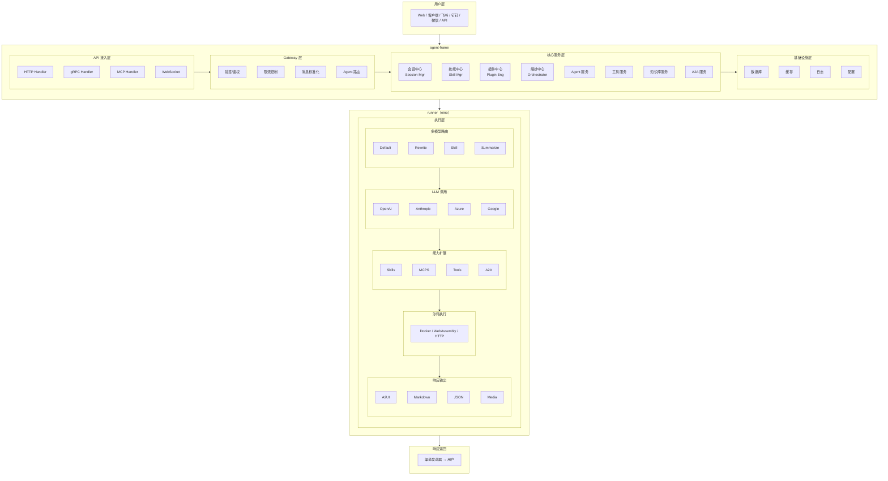

# XiaoQinglong
核心定位
小青龙 Agent OS 是一款企业级智能体运行框架，支持多渠道接入（Web/飞书/钉钉/微信）、多模型智能路由（default/rewrite/skill/summarize）、可视化编排（Reasoning → Tools → Approval → 响应生成）、多协议（HTTP/gRPC/MCP）、技能中心（MCP/TOOL/SKILL/A2A）、外接知识库、Docker 沙箱安全执行，以及多格式响应（text/markdown/json/a2ui/多媒体）、sub-agent等特性。理论上可以完成任意场景的需求。

## Overall Architecture



## Runner 特性
* 多模型路由
* Skills生态，支持 agent-skills等
* MCP:支持 SSE/stdio/HTTP 三种传输模式
* Tools
* A2A
* 上下文压缩 - Token 超限自动压缩
* 知识检索 - 多知识库配置
* deep-agents
* Sub-Agent - 并行任务
* 定时任务 - Cron 表达式
* 沙箱执行 - Docker/Local 双模式
* 审批策略 - 风险分级 + 白名单自动批准
* 重试熔断 - 指数退避
* Checkpoint - 中断恢复
* 记忆系统 - user/feedback/project/reference
* Prompt 缓存 - 静态 section 缓存

### 多模型路由
支持按角色选择不同模型，优化成本和性能:

| 角色        | 说明           | 用途            |
| ----------- | -------------- | --------------- |
| `default`   | 默认主对话模型 | 主对话流程      |
| `rewrite`   | Query 改写模型 | 用户 Query 优化 |
| `skill`     | Skill 执行模型 | 技能执行        |
| `summarize` | 总结模型       | 内容摘要        |

```json
"options": {
    "routing": {
        "default_model": "default",
        "rewrite_prompt": "优化以下用户Query...",
        "summarize_prompt": "请总结以下内容..."
    }
}
```

### 响应格式 (response_schema)
支持多种输出格式，可通过 `response_schema.type` 指定:

| 类型                | 说明            | 用途            |
| ------------------- | --------------- | --------------- |
| `text`              | 纯文本          | 简单文本回复    |
| `markdown`          | Markdown 格式   | 富文本回复      |
| `json`              | JSON 结构化     | structured data |
| `a2ui`              | A2UI 组件化格式 | 前端组件渲染    |
| `image/audio/video` | 多媒体          | 媒体生成        |
| `multipart`         | 多格式混合      | 复合响应        |

```json
"response_schema": {
    "type": "a2ui",
    "schema": { ... }
}
```

### 流式响应
启用 SSE 流式输出:

```json
"options": {
    "stream": true
}
```

### 重试机制
指数退避重试策略:

```json
"options": {
    "retry": {
        "max_attempts": 3,
        "initial_delay_ms": 1000,
        "max_delay_ms": 10000,
        "backoff_multiplier": 2.0,
        "retryable_errors": ["timeout", "rate_limit"]
    }
}
```

### 限流控制
```json
"options": {
    "max_tool_calls": 10,
    "max_a2a_calls": 5,
    "max_iterations": 10,
    "max_total_tokens": 8000
}
```

### 执行 Metadata
响应包含完整执行详情:

| 字段                | 说明                                       |
| ------------------- | ------------------------------------------ |
| `model`             | 使用的模型                                 |
| `latency_ms`        | 总延迟(毫秒)                               |
| `prompt_tokens`     | Prompt token 消耗                          |
| `completion_tokens` | Completion token 消耗                      |
| `tool_calls_count`  | 工具调用次数                               |
| `a2a_calls_count`   | A2A 调用次数                               |
| `skill_calls_count` | Skill 调用次数                             |
| `iterations`        | 迭代次数                                   |
| `tool_calls_detail` | 工具调用详情(名称/输入/输出/延迟/成功状态) |
