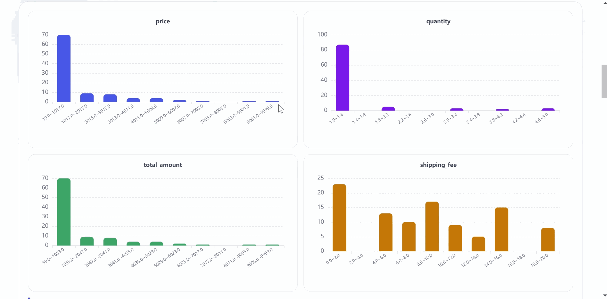
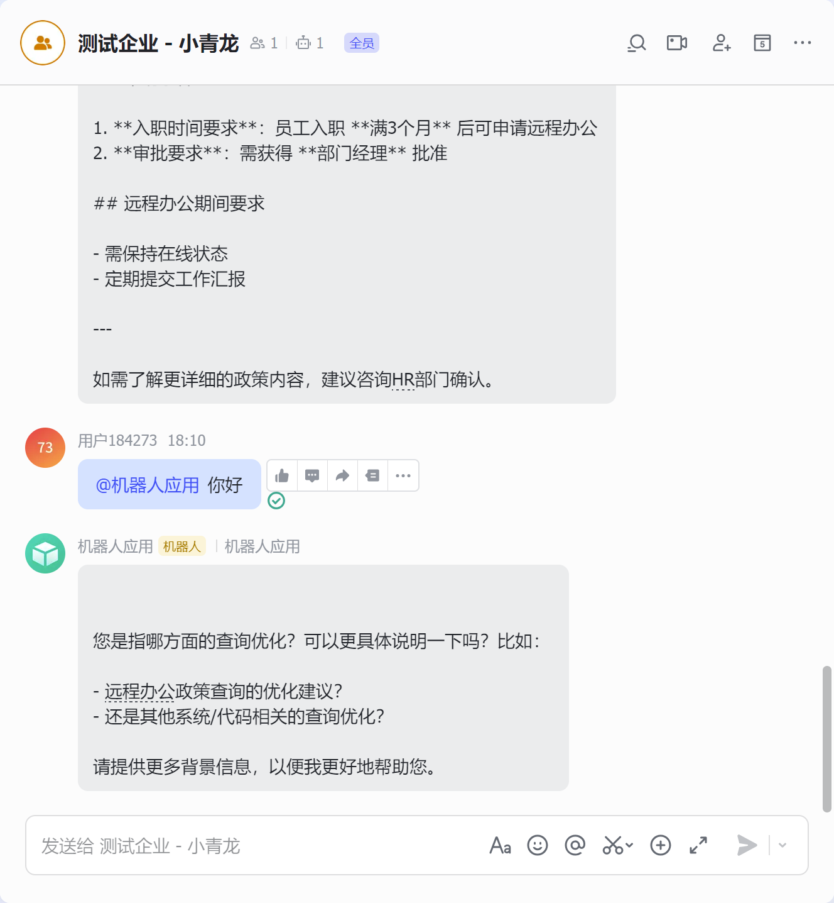
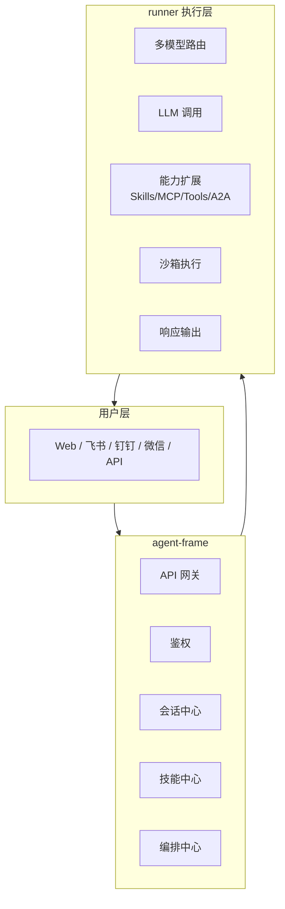

# XiaoQinglong 小青龙

**企业级智能体运行框架** - 让 AI Agent 在生产环境中真正落地

[](./LICENSE)
[](https://golang.org)
[]()

> 小青龙是面向企业的智能体操作系统，支持多渠道接入、多模型路由、可视化编排、技能生态、MCP 协议、沙箱执行等企业级特性。

---

## 核心特性

| 分类         | 功能                                                |
| ------------ | --------------------------------------------------- |
| **模型能力** | 多模型路由 · 上下文压缩 · Prompt 缓存 · deep-agents |
| **工具生态** | Skills · MCP (SSE/stdio/HTTP) · Tools · A2A         |
| **执行保障** | 沙箱执行 · 审批策略 · 重试熔断 · Checkpoint         |
| **记忆系统** | user · feedback · project · reference               |
| **工程化**   | 定时任务 · Sub-Agent 并行 · 知识检索                |
| **响应格式** | text · markdown · json · a2ui · 多媒体              |

---

## 为什么选择小青龙？

### 🔄 多模型智能路由

按任务角色自动选择最优模型，兼顾成本与效果：

| 角色        | 用途       | 典型场景 |
| ----------- | ---------- | -------- |
| `default`   | 主对话     | 用户问答 |
| `rewrite`   | Query 改写 | 搜索增强 |
| `skill`     | 技能执行   | 复杂任务 |
| `summarize` | 内容总结   | 长文摘要 |

### 🛡️ 企业级安全保障

```
风险分级审批 + 白名单自动通过 + 沙箱隔离执行
```

- **审批策略**：low/medium/high 三级风险控制
- **沙箱执行**：Docker / Local 双模式，危险操作隔离
- **熔断机制**：指数退避重试，防止雪崩

### ⚡ 生产级可靠性

- **Checkpoint**：中断恢复，长任务不丢失
- **上下文压缩**：Token 超限时自动压缩上下文
- **记忆系统**：跨 session 保持用户偏好和上下文

### 🔌 开放生态

- **MCP 协议**：支持 SSE / stdio / HTTP 三种传输模式
- **A2A 协议**：Agent 之间互相调用，构建复杂工作流
- **Skills 生态**：自我创建 Skill，Agent 自我进化

---

### 场景演示
* 数据分析：




* 微信claw:


* 飞书:




* 丰富的功能与编排：


## 整体架构



---

## 快速开始

### 1. 启动 Runner

```bash
cd backend/runner
./runner
# 默认监听 :18080
```

### 2. 发送请求

```bash
curl -X POST http://localhost:18080/run \
  -H "Content-Type: application/json" \
  -d '{
    "prompt": "帮我分析今天天气",
    "models": {
      "default": {"name": "gpt-4o", "api_key": "sk-xxx", "api_base": "https://api.openai.com/v1"}
    },
    "options": {"stream": false}
  }'
```

### 3. 流式响应

```bash
curl -X POST http://localhost:18080/run \
  -H "Content-Type: application/json" \
  -d '{"prompt": "写一段 Python 代码", "options": {"stream": true}}'
# 支持 SSE 流式输出
```

---

## Runner 完整特性

### 模型层
- **多模型路由**：default / rewrite / skill / summarize 四角色
- **上下文压缩**：Token 超限自动压缩（支持 full/partial/micro 三种策略）
- **Prompt 缓存**：静态 section 缓存，避免重复计算
- **deep-agents**：深度推理模式，复杂问题拆解

### 工具生态
- **Skills**：技能中心，支持 agent-skills、自我创建 Skill
- **MCP**：支持 SSE / stdio / HTTP 三种传输模式
- **Tools**：内置 bash / file / glob / grep / web-fetch 等工具
- **A2A**：Agent-to-Agent 协议，构建分布式智能体网络

### 执行保障
- **沙箱执行**：Docker / Local 双模式，危险操作隔离
- **审批策略**：风险分级 + 白名单自动批准
- **重试熔断**：指数退避，支持熔断器配置
- **Checkpoint**：中断恢复，长任务不丢失

### 记忆系统
- **user**：用户信息记忆
- **feedback**：用户反馈记忆
- **project**：项目上下文记忆
- **reference**：外部知识引用

### 工程化
- **定时任务**：Cron 表达式，支持循环执行
- **Sub-Agent**：并行任务执行，提升吞吐量
- **知识检索**：多知识库配置，RAG 支持

### 响应格式
- **text / markdown / json**：文本响应
- **a2ui**：组件化格式，前端直接渲染
- **image / audio / video**：多媒体生成
- **multipart**：多格式混合响应

---

## 配置示例

### 多模型路由

```json
{
  "options": {
    "routing": {
      "default_model": "default",
      "rewrite_prompt": "优化以下用户Query...",
      "summarize_prompt": "请总结以下内容..."
    }
  }
}
```

### 重试与熔断

```json
{
  "options": {
    "retry": {
      "max_attempts": 3,
      "initial_delay_ms": 1000,
      "max_delay_ms": 10000,
      "backoff_multiplier": 2.0,
      "circuit_breaker_threshold": 5,
      "circuit_breaker_duration_ms": 30000
    }
  }
}
```

### 沙箱执行

```json
{
  "sandbox": {
    "enabled": true,
    "mode": "docker",
    "image": "python:3.11-slim",
    "network": "bridge",
    "limits": {"cpu": "0.5", "memory": "512m"}
  }
}
```

---

## 执行元数据

每次响应包含完整执行详情：

| 字段                | 说明                  |
| ------------------- | --------------------- |
| `model`             | 使用的模型            |
| `latency_ms`        | 总延迟(毫秒)          |
| `prompt_tokens`     | Prompt token 消耗     |
| `completion_tokens` | Completion token 消耗 |
| `tool_calls_count`  | 工具调用次数          |
| `a2a_calls_count`   | A2A 调用次数          |
| `skill_calls_count` | Skill 调用次数        |
| `iterations`        | 迭代次数              |
| `tool_calls_detail` | 工具调用详情          |

---

## 如何运行

详细运行文档：[README-RUN.md](./README-RUN.md)

---

## License

Apache 2.0 License